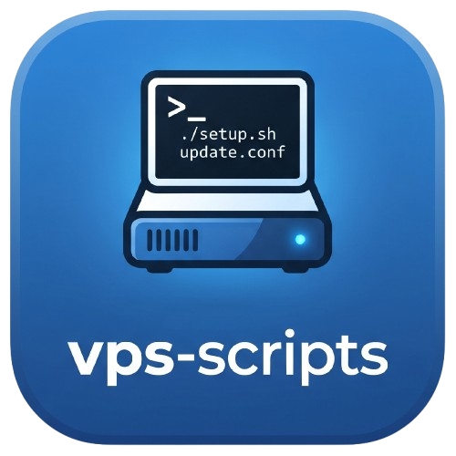

<!-- Improved compatibility of back to top link: See: https://github.com/othneildrew/Best-README-Template/pull/73 -->

<a id="readme-top"></a>

<!--
*** Thanks for checking out the Best-README-Template. If you have a suggestion
*** that would make this better, please fork the repo and create a pull request
*** or simply open an issue with the tag "enhancement".
*** Don't forget to give the project a star!
*** Thanks again! Now go create something AMAZING! :D
-->

<!-- PROJECT SHIELDS -->
<!--
*** I'm using markdown "reference style" links for readability.
*** Reference links are enclosed in brackets [ ] instead of parentheses ( ).
*** See the bottom of this document for the declaration of the reference variables
*** for contributors-url, forks-url, etc. This is an optional, concise syntax you may use.
*** https://www.markdownguide.org/basic-syntax/#reference-style-links
-->

[![Contributors][contributors-shield]][contributors-url]
[![Forks][forks-shield]][forks-url]
[![Stargazers][stars-shield]][stars-url]
[![Issues][issues-shield]][issues-url]
[![MIT License][license-shield]][license-url]

<!-- PROJECT LOGO -->
<br />
<div align="center">
  <a href="https://github.com/LoveDoLove/vps-scripts">
    
  </a>

<h3 align="center">LoveDoLove VPS Management Toolkit</h3>

  <p align="center">
    A comprehensive, modular VPS management toolkit with bilingual (Chinese/English) support.
    Features a Docker App Store, firewall & WAF security, SSL certificate management, kernel
    & BBR tuning, LDNMP web stack, FRP tunneling, system benchmarks, and more.
    <br />
    <a href="https://github.com/LoveDoLove/vps-scripts"><strong>Explore the docs »</strong></a>
    <br />
    <br />
    <a href="https://github.com/LoveDoLove/vps-scripts">View Demo</a>
    &middot;
    <a href="https://github.com/LoveDoLove/vps-scripts/issues/new?labels=bug&template=bug-report---.md">Report Bug</a>
    &middot;
    <a href="https://github.com/LoveDoLove/vps-scripts/issues/new?labels=enhancement&template=feature-request---.md">Request Feature</a>
  </p>
</div>

<!-- TABLE OF CONTENTS -->
<details>
  <summary>Table of Contents</summary>
  <ol>
    <li>
      <a href="#about-the-project">About The Project</a>
      <ul>
        <li><a href="#built-with">Built With</a></li>
      </ul>
    </li>
    <li>
      <a href="#getting-started">Getting Started</a>
      <ul>
        <li><a href="#prerequisites">Prerequisites</a></li>
        <li><a href="#installation">Installation</a></li>
      </ul>
    </li>
    <li><a href="#usage">Usage</a></li>
    <li><a href="#contributing">Contributing</a></li>
    <li><a href="#license">License</a></li>
    <li><a href="#contact">Contact</a></li>
    <li><a href="#acknowledgments">Acknowledgments</a></li>
  </ol>
</details>

<!-- ABOUT THE PROJECT -->

## About The Project

LoveDoLove VPS Management Toolkit is a modular, all-in-one server operations toolbox.
The original monolithic scriptbase was completely refactored into a modular architecture
with full bilingual (Traditional Chinese / English) support.

**Key highlights:**

- **Modular architecture** — each feature lives in its own script under `scripts/`, loaded on demand
  from a central `main.sh` menu or remotely via `bash <(curl ...)`.
- **Bilingual by default** — the interface auto-detects your system language (`$LANG`) and renders
  all menus and messages in Chinese or English.
- **One-command deployment** — run the toolkit directly from GitHub without downloading anything.
- **Cross-distro compatible** — verified on Debian/Ubuntu (apt), RHEL/Rocky/Alma/CentOS (dnf/yum),
  Alpine (apk), Arch (pacman), openSUSE (zypper), and more.
- **Docker App Store** — deploy MySQL, Redis, phpMyAdmin, Nginx Proxy Manager, Portainer, 1Panel,
  WordPress, Postgres + pgAdmin, standalone Nginx, Vaultwarden, and sandboxed Node.js/Python
  environments — all with built-in port collision detection.
- **Network-resilient** — configurable GitHub proxy (`GH_PROXY`) for users in mainland China,
  strict curl timeouts to prevent hanging, and IPv4 preference toggle.

<p align="right">(<a href="#readme-top">back to top</a>)</p>

### Built With

- [![Bash][Bash.sh]][Bash-url]
- [![Docker][Docker.com]][Docker-url]
- [![curl][curl.haxx.se]][curl-url]

<p align="right">(<a href="#readme-top">back to top</a>)</p>

<!-- GETTING STARTED -->

## Getting Started

To get a local copy up and running, follow these simple steps.

### Prerequisites

- **Root access** — most operations require `root` privileges.
- **curl or wget** — for remote module loading and API calls.
- **Docker** (optional) — required for the App Store and LDNMP web stack features.

### Installation

**Option 1 — Direct remote execution (no download required):**

```sh
bash <(curl -fsSL https://raw.githubusercontent.com/LoveDoLove/vps-scripts/main/main.sh)
```

**Option 2 — Clone and run locally:**

1. Clone the repo
   ```sh
   git clone https://github.com/LoveDoLove/vps-scripts.git
   ```
2. Make scripts executable
   ```sh
   cd vps-scripts && chmod +x main.sh scripts/*.sh lib/*.sh
   ```
3. Launch the toolkit
   ```sh
   bash main.sh
   ```

**Option 3 — Specify language on first run:**

```sh
bash main.sh cn    # Force Chinese interface
bash main.sh en    # Force English interface
```

<p align="right">(<a href="#readme-top">back to top</a>)</p>

<!-- USAGE EXAMPLES -->

## Usage

The toolkit presents an interactive numbered menu. Enter the number of the module you want to load:

| # | Module | Description |
|---|--------|-------------|
| 1 | System Tools | Hostname, timezone, DNS, SSH port, swap, BBR, Fail2ban |
| 2 | Firewall & WAF | Port management, IP blacklist/whitelist, DDoS limits, geo-blocking (ipset) |
| 3 | Kernel & BBR | Native BBR, XanMod kernel (BBRv3), ELRepo upgrades |
| 4 | SSL Certificates | Let's Encrypt auto-renew, custom cert import, crontab integration |
| 5 | LDNMP Web Stack | Docker-based Nginx + MySQL + PHP + Redis, site management with WAF/Brotli/Zstd |
| 6 | Docker Management | Docker installation, container monitoring, image cleanup |
| 7 | Docker App Store | One-click deploy MySQL, Redis, phpMyAdmin, NPM, Portainer, 1Panel, WordPress, Postgres, Nginx, Vaultwarden |
| 8 | FRP Tunneling | FRP client/server setup with port forwarding and monitoring (Grafana/Prometheus) |
| 9 | Backups & Cron | `/home/web` backup/restore, scheduled tasks |
| 10 | Benchmarks | YABS performance test, speedtest, streaming unlock check, nexttrace routing |
| 11 | Network Tools | Cloudflare WARP, DNS optimization, IPv4 preference |
| 12 | DD Reinstall | One-click OS reinstall (Linux/Windows) |
| 13 | Oracle Cloud | Open iptables ports, remove Oracle monitoring agents, growpart disk resize |

_For more details, refer to each script's embedded help text or the
[source code](https://github.com/LoveDoLove/vps-scripts/tree/main/scripts)._

<p align="right">(<a href="#readme-top">back to top</a>)</p>

See the [open issues](https://github.com/LoveDoLove/vps-scripts/issues) for a full list of proposed features (and known issues).

<p align="right">(<a href="#readme-top">back to top</a>)</p>

<!-- CONTRIBUTING -->

## Contributing

Contributions are what make the open source community such an amazing place to learn, inspire, and create. Any contributions you make are **greatly appreciated**.

If you have a suggestion that would make this better, please fork the repo and create a pull request. You can also simply open an issue with the tag "enhancement".
Don't forget to give the project a star! Thanks again!

1. Fork the Project
2. Create your Feature Branch (`git checkout -b feature/AmazingFeature`)
3. Commit your Changes (`git commit -m 'Add some AmazingFeature'`)
4. Push to the Branch (`git push origin feature/AmazingFeature`)
5. Open a Pull Request

### Development guidelines

- All scripts must source `lib/common.sh` for colors, package management, and translations.
- Add new UI strings to `get_msg()` in `lib/common.sh` (or the module-level translation function).
- The `GH_PROXY` variable in `lib/common.sh` should be respected by all modules fetching remote resources.
- Use `check_port_taken()` before binding container ports in App Store deployments.
- Test across at least Debian/Ubuntu and Alpine before submitting.

### Top contributors:

<a href="https://github.com/LoveDoLove/vps-scripts/graphs/contributors">
  
</a>

<p align="right">(<a href="#readme-top">back to top</a>)</p>

<!-- LICENSE -->

## License

Distributed under the MIT License. See `LICENSE` for more information.

<p align="right">(<a href="#readme-top">back to top</a>)</p>

<!-- CONTACT -->

## Contact

LoveDoLove - [@LoveDoLove](https://github.com/LoveDoLove)

Project Link: [https://github.com/LoveDoLove/vps-scripts](https://github.com/LoveDoLove/vps-scripts)

<p align="right">(<a href="#readme-top">back to top</a>)</p>

<!-- ACKNOWLEDGMENTS -->

## Acknowledgments

- [Best-README-Template](https://github.com/othneildrew/Best-README-Template) — README template
- [othneildrew](https://github.com/othneildrew) — README template author
- This project is a modular bilingual fork of [kejilion/sh](https://github.com/kejilion/sh) — a comprehensive Linux server management toolkit.
- [Docker](https://docker.com) — container runtime
- [Let's Encrypt](https://letsencrypt.org) — free SSL certificates
- [Cloudflare WARP](https://1.1.1.1) — network privacy gateway

<p align="right">(<a href="#readme-top">back to top</a>)</p>

<!-- MARKDOWN LINKS & IMAGES -->
<!-- https://www.markdownguide.org/basic-syntax/#reference-style-links -->

[contributors-shield]: https://img.shields.io/github/contributors/LoveDoLove/vps-scripts.svg?style=for-the-badge
[contributors-url]: https://github.com/LoveDoLove/vps-scripts/graphs/contributors
[forks-shield]: https://img.shields.io/github/forks/LoveDoLove/vps-scripts.svg?style=for-the-badge
[forks-url]: https://github.com/LoveDoLove/vps-scripts/network/members
[stars-shield]: https://img.shields.io/github/stars/LoveDoLove/vps-scripts.svg?style=for-the-badge
[stars-url]: https://github.com/LoveDoLove/vps-scripts/stargazers
[issues-shield]: https://img.shields.io/github/issues/LoveDoLove/vps-scripts.svg?style=for-the-badge
[issues-url]: https://github.com/LoveDoLove/vps-scripts/issues
[license-shield]: https://img.shields.io/github/license/LoveDoLove/vps-scripts.svg?style=for-the-badge
[license-url]: https://github.com/LoveDoLove/vps-scripts/blob/main/LICENSE
[Bash.sh]: https://img.shields.io/badge/Bash-4EAA25?style=for-the-badge&logo=gnubash&logoColor=white
[Bash-url]: https://www.gnu.org/software/bash/
[Docker.com]: https://img.shields.io/badge/Docker-2496ED?style=for-the-badge&logo=docker&logoColor=white
[Docker-url]: https://docker.com
[curl.haxx.se]: https://img.shields.io/badge/curl-073551?style=for-the-badge&logo=curl&logoColor=white
[curl-url]: https://curl.se
